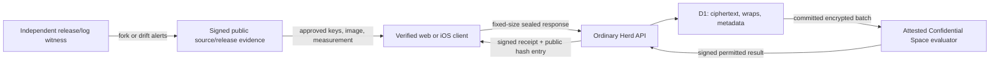

# Herd private-response architecture and threat model

Status: current implementation contract
Last reviewed: 2026-08-03

## Security objective

Herd lets a person say whether they can attend and optionally require a minimum
group size or one person from each selected group. The objective is to keep
those individual criteria out of ordinary Herd servers, databases, logs,
backups, hosts, and other guests while still resolving the event deterministically.

The scoped claim is **server-blind, account-linked private responses**. It is not
an anonymity, zero-knowledge, or no-inference claim.

## System boundary

### Trusted for response confidentiality

- the user's current device, browser/OS, and local platform key protection;
- the exact client bytes accepted by the user;
- Google Confidential Space hardware, firmware, PKI/launcher, STS, KMS, and the
  release-pinned evaluator image;
- the cryptographic implementations used by Web Crypto, CryptoKit/Security, and
  the evaluator runtime;
- release-signing and public-witness governance.

### Deliberately not trusted with response plaintext

- the ordinary Herd API/Worker and its administrators;
- D1 and its backups;
- the invitation/SMS provider and unattended scheduler/courier;
- the host, other guests, CDN, and response-transparency store;
- a browser relay carrying the opaque evaluation request/result.

## Protocol

The normative byte-level contract is
[`private-response-protocol-v1.md`](private-response-protocol-v1.md). In summary:

1. Invitation send freezes a canonical event/member/host-rule/deadline/reveal
   policy. The confidential evaluator validates the full schema and signs its
   exact canonical bytes with the policy key.
2. The client verifies that signature, hash, protocol limits, evaluator-key
   epoch ID, evaluator key/measurement, and event display before accepting
   input.
3. The client generates a random response key, pads canonical response JSON to
   4,096 bytes, and encrypts it with AES-256-GCM. It wraps the key once to the
   local account epoch and once through ephemeral P-256 ECDH to the evaluator.
   From the device-held Account Root Secret it also derives a per-event
   Ed25519 key, commits that public key into the unsigned envelope hash, and
   signs the event/member/policy/account-epoch/revision/envelope/hash tuple.
4. The ordinary API validates only envelope structure, authorization, frozen
   policy binding, revision ordering, sizes, hashes, response authorization,
   and account-key commitment. It has no private key capable of opening either
   wrap or creating the device-held response authorization.
5. In one D1 transaction the API appends the response and the next log
   commitment. The confidential authority verifies the Ed25519 signature,
   pins the member's first accepted response-signing key, atomically advances
   the member's exact latest revision and global log, then signs the receipt and
   head. The client verifies both and fetches the matching hash-only public
   entry before showing success.
6. At the deadline the backend proposes the latest envelope hash or explicit
   no-reply slot for every member. It first repairs a bounded oldest-first prefix
   of locally pending certifications by retrying their exact authority payloads;
   work still pending fails closed for a later retry. Before decrypting anything, the evaluator
   exact-reads the independently administered member documents, requires the
   proposed slots to equal every latest certified hash/revision/signing key,
   revalidates each member document against its exact signed immutable entry,
   and atomically consumes the policy for that one batch hash. A fixed-size
   opaque client-relay package carries the encrypted batch; an HMAC capability
   binds it to the backend-prepared request without exposing the bearer token.
7. Only after that consumption succeeds does the evaluator verify response
   authorization and envelope AEAD, compute the greatest fixed point, apply
   host rules, and sign exactly `not_confirmed` or confirmed attendance member
   IDs. A crash may retry the exact consumed batch, but no alternate subset or
   revision can be evaluated.
8. The API stores and returns the evaluator's exact signed result attestation,
   with the signed evaluation time as `resolvedAt`. Web and iOS independently
   verify the pinned result key and bind the event, frozen policy, canonical
   batch, evaluator key, status, attendees, and time before displaying a final
   answer. Missing proof, database tampering, and an unrecognized historical
   result key produce an explicit unavailable state rather than a mutable
   fallback result.

## Confidential evaluator

The production image starts only inside an authorized workload:

- a Google PKI launcher token must describe debug-disabled, secure-boot Intel
  TDX Confidential Space with STABLE support, the exact container image,
  workload project/service account, empty command/environment overrides,
  `restart_policy == Always`, and memory monitoring off;
- the exact OIDC token is exchanged through the pinned Workload Identity Pool;
  only that authenticated identity may independently decrypt the evaluator-epoch
  bundle and global response-log identity in KMS;
- the service derives its measurement from the tokens that actually authorized
  both STS/KMS decryptions, requires their image digests to match, and does not
  listen until the claim and all four key pairs are bound;
- response decryption, result signing, policy signing, and transparency signing
  use distinct P-256 key pairs imported as non-exportable CryptoKeys. The first
  three belong to an evaluator-key epoch; transparency signing is a separately
  wrapped lifetime-global identity for `herd-response-log-v1`;
- policy and transparency signers accept only Herd's exact canonical schemas;
  they are not general signing oracles;
- the custodian Firestore authority first-writes immutable policy hash,
  deadline, ordered opaque member IDs, and evaluator commitments; it stores no
  event title, host/guest name, phone, location, or description;
- response append and evaluation consumption serialize through one policy CAS.
  A last receipt either becomes part of the canonical batch or loses to
  consumption; both pre- and post-receipt snapshots cannot be accepted;
- request bodies, decrypted responses, private keys, event IDs, and per-person
  failures are never logged. Container output redirection and memory monitoring
  are disabled.

The image uses an evaluator-epoch-wide response-decryption key. Historical exposure is
bounded by deleting resolved response ciphertext after 90 days, provider backup
retention, epoch rotation, and destruction of old epoch material only after
every policy using it is terminal. This is not per-event forward secrecy.

## Attestation and client trust

Immediately before sealing, each client generates a fresh 32-byte nonce. The
backend can only proxy the evaluator's bounded response; it cannot mint an
accepted proof. Web and iOS independently validate:

- RS256 JWT signature and an X.509 chain to the release-pinned official Google
  Confidential Space root/fingerprint;
- issuer, audience, freshness, nonce, and a second nonce equal to the hash of
  the complete four-key/evaluator-epoch binding, including the unchanged global
  transparency key;
- secure boot, debug state, Intel TDX/attester, Confidential Space name/version,
  Google OEM ID, support state, project, exactly one service account, image
  digest, no overrides, Always restart, and memory monitoring off;
- exact equality between attested keys/release and the signed frozen policy.

Google currently documents `tdx.gcp_attester_tcb_status` but not a stable public
allowlist of acceptable strings. The implementation does not invent one. A
production custodian must record an observed/approved value policy before
activation and update it only through a signed release.

## Append-only transparency

The response log exposes only index, previous hash, entry hash, and signed head.
Receipt payloads bind envelope/event/invitee identifiers, policy hash, account
key epoch, revision, ciphertext hash, Ed25519 public key and authorization,
time, log index, previous hash, and entry hash. An API cannot alter these
without invalidating the response authorization and transparency signatures.

The attested signer CAS-commits each immutable entry, tail transition, policy
response sequence, and latest member commitment to the key-custodian Firestore
authority before returning a signature. First revisions must be exactly 1;
later revisions must be exactly previous + 1 and use the pinned Ed25519 key.
They must also retain the enrolled account-key epoch; a valid signature under
the same key cannot relabel a response into another epoch.
Before accepting that later revision, and again before evaluation, the
authority verifies that every field in the latest-member index matches its
referenced immutable receipt and verifies that receipt and its log head under
the transparency key. The member document is therefore an index, not an
independent unsigned source of batch truth.
New appends stop at the authority clock deadline and after evaluation
consumption; an already committed exact receipt retry still returns its stored
certification. The authority verifies the stored tail and its receipt/head
signatures under the one global key at startup and before appends, and rejects
gaps, rewinds, forks, key changes, stale revisions, and unsigned responses.
Before batch selection, the application uses that idempotency to recover a
bounded prefix whose authority commit succeeded but whose response or local
receipt persistence was lost. It never treats an unsigned local row as
certified, and a permanent authority conflict remains distinct from a transient
outage. If a valid reservation provably never committed before its window
closed, the authority instead signs the rejected entry and exact current head
under a reconciliation-only domain. The application verifies that proof,
refuses cleanup if any suffix row has certification evidence, and atomically
abandons only the wholly uncertified suffix. New reservations explicitly bind
to the surviving predecessor, so unrelated events are not permanently blocked.

At evaluation it exact-reads all policy members and consumes one canonical
batch hash before any response decryption or result computation. Exact retries
survive a process crash. Different batches, omitted responses, null substitutes,
older revisions, and member indexes that do not match their signed entries are
rejected. This prevents the ordinary backend from
turning the evaluator into a chosen-subset response oracle.

These controls do not make a malicious key custodian harmless. Independent
witnesses must remember the last index/hash/key and gossip signed heads outside
the production account. The included monitor implements this verification;
independence comes from who deploys and controls it.

## Identity, recovery, and metadata

Phone verification authenticates the account but is not an encryption key. The
Account Root Secret is random and device-held. A different device cannot
silently replace an initialized epoch. A freshly phone-verified user may
explicitly start over: Herd creates a new epoch and revokes other sessions, but
cannot recover the old criteria. A new Account Root Secret derives a different
per-event response-signing key. Therefore an active invitation that already
has a certified response is locked against new revisions after reset; its exact
old envelope may still be retried. A never-answered invitation or a new event
may enroll its first response-signing key.

The first response is the enrollment because the current SMS/account trust
path has no independently authenticated client-to-authority identity channel.
A compromised ordinary backend can front-run a never-enrolled slot with its own
valid key and response. A later genuine attempt sees a key conflict rather than
silently replacing the attacker's entry, but a person who never responds has no
client-side observation. Fully preventing first-enrollment forgery requires a
new direct identity enrollment channel outside the ordinary backend and is not
claimed by this release.

Herd still observes phone/profile, event and guest membership, response slot,
timing, IP/user agent, fixed message size, delivery status, ciphertext hashes,
and the final result. The host may infer criteria from a small group, repeated
events, sybil guests, the final attendance set, or real-world behavior.

## Adversaries and residual limits

| Actor/failure | Protection | Residual limit |
| --- | --- | --- |
| Host or another guest | No API projection of an individual response/conditions; only final permitted result | Can infer from context or manipulate whom they invite |
| Database/backup reader | Fixed-size AEAD ciphertext and unusable wraps | Sees account/event linkage, hashes, revision and timing; old backups retain sealed bytes temporarily |
| Ordinary app administrator | No evaluator private key; client verifies policy, Ed25519-bound receipt, public entry, hardware attestation, and the exact signed final-result proof; committed keys/revisions and canonical batches are authority-enforced | Can deny service, target metadata, ship a malicious future web client unless witnessed, or front-run a never-enrolled response slot |
| CDN/network observer | Payload is encrypted and fixed-size | Sees IP, account flow timing, origin, user agent and traffic pattern |
| SMS takeover | Cannot decrypt an old response or create a later revision under its pinned response-signing key | Can take over/reset the account, lose access to answered active invitations, and enroll unanswered/new invitations |
| Compromised device/browser | Platform key protection and lock-on-background reduce exposure | Malware/extensions can see what the user sees before encryption |
| Cloud host | TDX isolation, remote attestation, WIP/KMS claim policy | Trust remains in Google/Intel roots and implementation; side-channel/platform failures remain possible |
| Malicious backend/signing operator | Purpose-specific exact-schema signatures, response-key pinning, canonical-batch consumption, and public entry verification | Can front-run a never-enrolled slot or deny/suppress service; log/release equivocation requires independent persistent witnesses to detect |
| Malicious evaluator update | Clients pin signed release/image/keys and fresh hardware claims | Compromised release-signing governance can approve a bad release |

## Production separation and operations

Production and QA require different origins, Sites/cloud projects, D1
databases, Twilio credentials, auth peppers, evaluator/KMS keys, release IDs,
attestation image/project/account pins, transparency logs, monitor state, and
iOS bundle/release configuration. Production refuses to operate with the QA
bypass or direct evaluator transport. A preview/software evaluator is a test
resource and can never satisfy production attestation.

The exact data inventory, retention schedule, privacy drill, restore procedure,
and incident triggers are in
[`data-retention-and-privacy-operations.md`](data-retention-and-privacy-operations.md).
Confidential deployment, rotation, rollback, and destruction procedures are in
the dedicated evaluator deployment/runbook documents.

## Claim boundary

Open source and self-authored tests demonstrate inspectable design and make
regressions harder; they do not prove which code is running. A launch claim
requires the external activation evidence listed in
[`private-response-implementation-status.md`](private-response-implementation-status.md):
public source commit, signed release-assembly evidence that binds already-built
artifact bytes (plus component build provenance where separately published),
immutable deployment digest, live fresh hardware attestation, externally
witnessed release/log heads, deletion/restore drills, and independent review.

Avoid “anonymous,” “zero knowledge,” “impossible to determine,” and “nobody can
ever know.” The final result, metadata, compromised endpoints, and human context
make those statements false.
